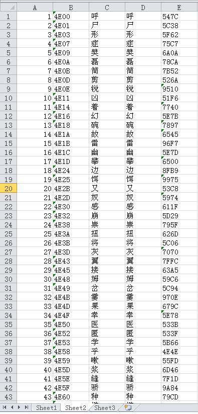

# [掌上书苑][经验交流] 关于破解《伊岚翠》的字体乱码加密
[*多年以前在掌上书苑的作品*](https://www.cnepub.com/discuz/thread-134582-1-1.html)

首先，感谢Ivy姐的审核。

以前有人问过这个问题，鼓捣半天算是有了初步结果。首先说在前面，我本人的背景与CS有点儿远，所做纯属业余兴趣，所以有不当之处恳请众位高手赐教，在此先行谢过。

### 问题：书源是chm文档，做了手脚，直接复制文字会乱码。
### 解法：
1. 首先用Html help workshop解包，直接看网页源代码：正文确实是乱码，内在解码方法是名为“Elantris.eot”的嵌入字体。
2. 研究“Elantris.eot”，这是微软网页字体嵌入技术的产物，从ttf压缩而来，文件结构我没搞清楚，直接想办法转回ttf。网上多是ttf转eot，唯一找到的eot转ttf是一个perl程序的函数库中的一个函数，拿来源代码，想办法编译，然后转换得到“Elantris.ttf”。
3. 研究“Elantris.ttf”，可以先用软件看一看（比如fontcreator），不过个人觉得没用，因为不知道怎么提取cmap编码表。所以直接看ttf。ttf文件结构开源，分析后找到cmap编码表，不是很复杂，就是找个地址。因为没能力碰字型，所以要利用word来搞出字体中的所有字。
4. 在系统上装上Elantris.ttf，然后根据上面找到的cmap编码表，列出字体中所有字的内码（四位十六进制数，用vba遍历cmap即可），共3080个，包括汉字和37个符号。然后用word中的Alt+X（或vba的togglecharactercode）方法把所有内码转换成字形，再把字体设为“测试”（Elantris.ttf安装完的字体名称是“测试”），这样就得到了字体文件中所有的字。
5. 首先检查37个符号的unicode码和“伊岚翠”码，是一致的，所以删掉不管。然后只剩汉字。这时打印到pdf，再用ocr把所有字型识别成宋体（或任何unicode编码的字体），这里最好逐字对照（相对全书上万字，这里只ocr3043个字，我个人觉得还是省了一些事儿的）。这样就可以得到unicode编码，在word中转为4位内码，最终在word或excel中我们可以建立unicode码和“伊岚翠”码的对应关系，然后又发现有221个汉字的编码一致，删掉不管，这样需要转码的有2822个。
6. 根据对应关系转码，方法就很多了。我就简单笨办法，word中，字->“伊岚翠”码->unicode码->字，直接跑vba，然后就完事儿了。

### 一些好奇：
1. 有没有人知道加密的时候“Elantris.eot”是怎么生成的？不会也这么麻烦吧，是不是有现成的软件啊？
2. chm文件这么加密看来不是很保险，请问大侠们pdf如何？有没有办法从pdf中抠出cmap？听说做的好的加密pdf可以在文件中删掉cmap表，是吗？即使这样也有个内码转换吧？可以根据这个思路转码吗？

下面是书，以前有人求过两次，不知道是不是还活跃在书苑。请过来看看吧，谢谢！我就不做任务了，及时分享给大家重要。
@龍天 @取名字太麻烦 @neosjasmin @xiaoruizi911