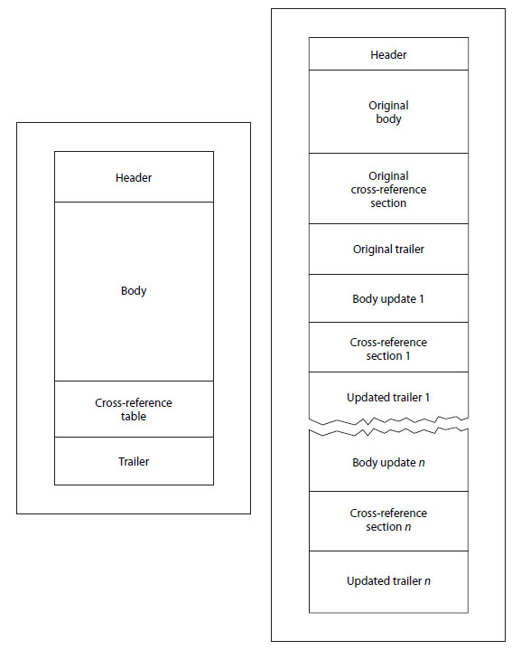
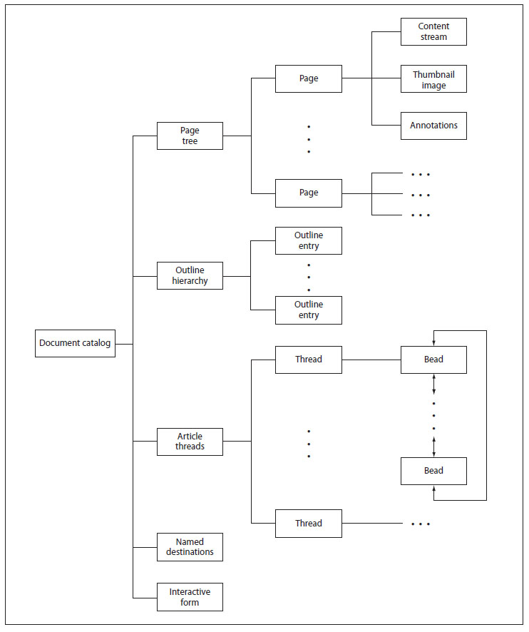

# [掌上书苑][教程] 浅谈pdf乱码——也许无用，权当学习吧!
[*多年以前在掌上书苑的作品*](https://www.cnepub.com/discuz/forum.php?mod=viewthread&tid=144793)

&#x3000;&#x3000;首先，恕我冒昧地圈一些人：  
&#x3000;&#x3000;@IvySun ：加入书院以来Ivy姐一直给我很多帮助和鼓励，上一片《伊兰翠》帖子也得到了Ivy姐的肯定，万分激动，所以先把Ivy请过来分享一下。  
&#x3000;&#x3000;@dande618 @霂訾君 ：蒙两位前辈不弃，还加我为好友；我敢大胆圈来的前辈也就您二位了。希望我鼓捣的这点儿东西能与两位分享。几个月以来一直在研究pdf，完全忽略了组里的工作，现在发帖彻底结束研究，完事儿后我会回组里干活的。  
&#x3000;&#x3000;@slqt ：感谢你分享的乱码pdf，这是本贴的重要素材。至于你说的其他乱码pdf也许可以同理处理，不过不能肯定。如果也是方正北魏楷书简体，你可以考虑先用这次的编码对照表重新编码试试。

&#x3000;&#x3000;无论是谁进来，我感谢您、也欢迎您。也许你会觉得这些东西没什么实际作用，也许你觉得我疯了，甚至你会不屑一顾。确实，我也知道乱码pdf不是很多、问题不是很严重；确实，我也觉得自己是疯了；确实，大家应该随意拍砖。不过既然走了这么远，还是写下些东西比较安心。  
&#x3000;&#x3000;我最初的想法是通解，但我的编程水平实在太差，文件处理操作不太搞得定，所以没能写成程序。不过呢，我在最后的实例中讲了一些关于通解的想法，也许通解是可能的。不管怎么说吧，就算是为了研究而研究吧。

&#x3000;&#x3000;**首先**我会介绍一下要讨论解决的问题，然后帖子内容分为两部分：
1. 一些有关pdf的基本知识，主要取材于Adobe的格式说明文档（www.adobe.com/devnet/acrobat/pdfs/PDF32000_2008.pdf ）。我会尽量说得通俗易懂，毕竟我也是外行人，希望大家不要害怕，试着看看，先谢谢了。
2. 以箫楼的青山接流水为例说明一下调整乱码的过程。

&#x3000;&#x3000;我还不太会格式化帖子，所以看起来不是很美观，大家见谅，我会慢慢改的。

一、问题的提出
----
&#x3000;&#x3000;pdf乱码的现象就是文字版pdf打开后一切正常，但是当你要复制文字出来到其他编辑器中的时候，复制出来的字跟原来的字不一样，就是乱码了。关于这种现象，此前的做法主要是考虑到内嵌字体，设法在系统中引入内嵌字体，希望可以配合pdf文件复制出来后的编码。如果不行，就需要全面的OCR。  
&#x3000;&#x3000;而我想要做得事情就是，希望不要全面OCR，做小部分调整就解决问题。主要思路还是《伊兰翠》思路：首先不考虑乱码，对于一篇文章来说，文章可以无限长，但是所用到的字符是有限的。以GB18030字符集为例，收录了27484个汉字，覆盖中文、日文、朝鲜语和中国少数民族文字。这样的数量相对一篇文章来说算是很少的了。所以如果你可以拿到一篇文章中用到的所有字符，生成字符—编码对应的字符集，就可以对整篇文章进行重新编码。再从另一个角度来看，如果有一篇文章有乱码，你只要找出所有错字，一个一个进行全文替换就可以完成修改。  
&#x3000;&#x3000;具体到pdf文件，设想你可以在第一页前面先加入一篇字符集，收录下面文章中的所有字符，然后进行转档操作（或者复制粘贴），文章中的乱码也会在字符集中得到体现，然后你先校对字符集，校对完了以后，就可以对文章内所有错字进行批量修改。  
&#x3000;&#x3000;为了实现这一目标，你需要知道怎样提取字符集，怎样把它放回到原来pdf的环境中，让文章中的乱码可以同样体现在字符集中，这就涉及到了pdf文件的文本是如何显示的，字体如何设置的，复制粘贴过程中的转码（以及转码错误导致的乱码）是如何发生的。

二、我对pdf文件结构的粗浅理解
----
&#x3000;&#x3000;pdf文件结构还是很复杂的，Adobe的说明文档长达756页（而且没有中文版），所以我根本不可能也没想过要读完，这里只是说一说这里用得到的一些东西。
pdf文件有两种结构要考虑，物理结构和逻辑结构：  
&#x3000;&#x3000;1. 物理结构：文件存储在计算机中的数据结构。  
&#x3000;&#x3000;2. 逻辑结构：读取pdf文件的逻辑，一步一步显示出文件的过程。

下面分别来说明：  
**先说物理结构的初始结构：**  
  
&#x3000;&#x3000;上面这张是物理结构图，左边是最常见的初始结构图，右边是扩展结构（下面才会说到）。pdf是一种二进制和文本混排的方式，什么意思呢？最直接的体现就是，你不需要什么UltraEdit等高级软件，不需要什么用二进制模式打开，用txt文本编辑器就可以打开pdf文件，同时可以阅读pdf文件的结构（但是有压缩的问题，下面说到）。现在你可以打开这里提到的“青山接流水”的pdf：  
&#x3000;&#x3000;Header就是文件头就两行，第一行是“%PDF-1.5”，说明pdf的版本。第二行是“%档档”，下文解压缩后会变成“%忏嫌”，我一直没搞清是什么意思，不过目前为止对我没有任何影响。然后下面就开始“10 obj”（不一定非要从1开始），这就是Body的部分了。  
&#x3000;&#x3000;Body是由一群对象（obj）组成，包含了下面要讲的所有逻辑结构，基本格式就是：
```
x g obj
…
endobj
```
&#x3000;&#x3000;其中第一行的x是一个数字，表示是第几号对象；第一行的g也是一个数字，Adobe说这是一个“代”（generation），而且一般为0（我没见过0以外的情况），作用我就不清楚了，不过就搞成0就好了，目前为止对我没有任何影响。然后第二行开始“…”代表对象中的内容（具体情况我在讲完逻辑结构后再讲），可以是任意行数、任意长度。最后另起一行以“endobj”结束。然后再另起一行就可以开始下一个对象。这些对象就代表了打开pdf我们看到的所有内容。N多对象后，就进入了Cross-reference table。  
&#x3000;&#x3000;Cross-referencetable是一个索引表，指出所有的对象。Adobe搞这个表主要是为了方便查找pdf文件中的所有对象，所以说对象的顺序不一定要1，2，3，…可以是5，9，3，9477，32，…只要索引表中写清楚就好，所以我上面说“不一定非要从1开始”Body。索引表的结构是这样的：
```
endobj
xref
x y
nnnnnnnnnn ggggg a
```
&#x3000;&#x3000;Body最后一个endobj结束后，首先写下“xref”（固定词组，也叫关键字）表示索引表开始。然后另起一行开始表中的内容，内容按组分。  
&#x3000;&#x3000;每一组首先是“x y”，x表示对象起始序号，y表示对象数目。比如“09668”就是说，这一组中描述的对象从0号开始，9668个对象，也就是这一组依次描述0、1、2、…、9668号对象，所以组与组之间可以不连续，比如第一组“0 9668”，第二组可以是“10001 3”，描述10001、10002、10003号对象。但是组与组不能重叠，也就是不能描述一个对象两次。  
&#x3000;&#x3000;再回到组，每组描述完组里内容后，另起一行开始y行“nnnnnnnnnn ggggg a”，从小到大依次排列，依次描述对象。“nnnnnnnnnn”是10位数字，表示这个对象开始的偏移地址，是个十进制的数，表示从文件第一个字节（1）开始，数多少个字节可以看到这个对象。“ggggg”是个五位十进制数字，表示对象的“代”。“a”有两种选择“f”或“n”，f表示对象已经废弃不用（尽管内容还留在文件中，但打开pdf时不会用到了），n表示对象仍在使用。  
&#x3000;&#x3000;上面说的很复杂，希望大家参照实例可以理解。这里要说一个问题，由于有了这个索引表和索引系统，如果你想要在文本编辑器中删掉（或添加）pdf（比如Body段）中几个字，那么就是灾难性的，因为这会完全毁灭pdf的地址号，就会出现打开错误。所以，你想替换字符，只要合适，pdf就没事儿；你想加减东西，那么需要彻底调整索引系统。  
&#x3000;&#x3000;最后是trailer，这是pdf打开时最先找到的东西（下面逻辑结构会提到），结构是这样的：
```
trailer
<< 
key1 value1
key2 value2
…
keyn valuen
>> 
startxref
x
%%EOF
```
&#x3000;&#x3000;首先“trailer”是固定的关键字，表示开始trailer段。然后是“<<”和“>>”括起来的一些内容。然后是固定的关键字“startxref”表示下面要说xref在哪里，下面用一个十进制数字x表示xref的地址，最后，一定要另起一行，写上固定的关键字“%%EOF”表示文件结束。  
&#x3000;&#x3000;“<<”和“>>”括起来的内容是一些项目，一个项目一行，“key1”、“key2”表示项目名称，然后空一格，“value1”、“value2”表示项目内容。项目很多很杂，我们会用到的是三项：
```
/Prev 8028560
/Root 1 0 R
/Size 9667
```
&#x3000;&#x3000;/Prev我下面将扩展结构时会说，pdf文件从上到下第一个出现的trailer是不会有这一项的。/Root表示pdf文件逻辑结构中的入口是哪一个对象，下面会讲到。这里第一次出现了引用对象的概念，引用对象的方法就是写出对象号和“代”号，然后用关键字“R”结尾表示引用，所以“1 0 R”对应对象“1 0 obj”。/Size表示pdf文件共有多少个对象。

**下面来说扩展物理结构：**  
&#x3000;&#x3000;上面提到你想加减东西，那么需要彻底调整索引系统，这很麻烦，但是pdf的一个特性就是可以不断在尾巴上加东西，所以我们就可以把我们地提取出来的字符集加在这里，让它们融入到原来的pdf中，形成“文章中的乱码可以同样体现在字符集中”的效果。加入的东西有三段：Body、Cross-reference table和trailer（没有Header，一个pdf只有一个Header）。这三段的内容都是更新的内容。在更新时，你完全不需要碰原来的部分。比如我们想添加一个object（比如添加一页）：首先找到原来最大的object号，比如9651号，我们就开始从9652编号。比如我们想修改一个object，找到原来的object，复制过来（不需要删除原来的）到新的Body段中，在新的地方改好它。  
&#x3000;&#x3000;然后在Cross-referencetable中列出这个新Body段中所有的（添加也好，修改也好）对象和相应地址，不需要管以前的object，只管新Body段中object。最后把原来的trailer段复制过来进行下面四种修改：
如果逻辑入口变了，就改/Root
如果添加了object（我特地没讨论删除，因为我们这里用不到），把/Size改大
添加上/Prev项，数字是上一个xref的地址，也就是上一个trailer中。“startxref”关键字下面的数字
把“startxref”关键字下面的数字改成新的Cross-reference     table的地址  
&#x3000;&#x3000;这样就完成了扩展结构的添加。

**下面来说逻辑结构：**  
  
&#x3000;&#x3000;这是pdf文件的全部逻辑结构，都在Body段中，每一个小方框就是一个或几个对象。但是我们这里不需要了解这么多，下面只讨论与文本内容有关的对象和逻辑结构，在讨论之前，需要先说明一个关于压缩的问题。  
&#x3000;&#x3000;pdf文件中的内容是可以以压缩形式存在的，所以大家看到的“青山接流水”的pdf需要解压缩才能跟上我下面说的内容，不过如果你不想麻烦，就看我附件中的“添加字符集后.pdf”，那是我解压缩并添加了字符集的文件，你用pdf阅读器打开后千万不要保存，AdobeReader会想要把pdf压缩回去（至少我这里是这样）。  
&#x3000;&#x3000;解压缩需要用到一个开源软件pdftk（http://www.pdflabs.com/tools/pdftk-the-pdf-toolkit/ ），是命令行软件，需要你会在你的系统下用命令行，才能使用。比如windows，安装好后再安装目录下会有pdftk.exe程序，用下面的命令行解压：
`pdftk qingshanjielvshui.pdf output jieya.pdf uncompress`  
&#x3000;&#x3000;这个软件应该比较成熟，pdf文件中的压缩方式很多，但是这个软件应该可以搞定，第二部分的实例中你想提取字符集，修改pdf必须要先解压。  
&#x3000;&#x3000;打开pdf文件后，软件首先找到最后一个trailer，然后从下往上更新索引表，重复的对象说明以靠后的新的输入为准，这就实现了pdf的更新，然后找到trailer中的/Root指出的对象，这就是逻辑结构中的Document catalog。在Document catalog中，结构类似trailer（忘了说，Adobe称为“字典”结构），像这样：
```
1 0 obj 
<< 
/MarkInfo 
<< 
/Marked true
>> 
/Lang (zh-CN)
/Pages 2 0 R
/StructTreeRoot 3 0 R
/Type /Catalog
>> 
endobj
```
&#x3000;&#x3000;“<<”和“>>”括起来很多项目，这里重要的是“/Pages 2 0 R”，它指出了第二个逻辑点Page Tree的对象，结构是这样：
```
2 0 obj 
<< 
/Kids [4 0 R 5 0 R 6 0 R 7 0 R 8 0 R 9 0 R 10 0 R 11 0 R 120 R 13 0 R 14 0 R 15 0 R 16 0 R 17 0 R 18 0 R 19 0 R 20 0 R 21 0 R 22 0 R 23 0R 24 0 R 25 0 R 26 0 R 27 0 R 28 0 
……
0 R 1004 0 R 1005 0 R 1006 0 R 1007 0 R 1008 0 R 1009 0 R1010 0 R 1011 0 R 1012 0 R 1013 0 R 1014 0 R 1015 0 R 1016 0 R 1017 0 R 1018 0R 1019 0 R 1020 0 R]
/Count 1017
/Type /Pages
>> 
endobj
```
&#x3000;&#x3000;这是我们下面需要修改的一个结构，需要仔细说明一下。这个逻辑点主要是说明pdf文件中的所有页面在哪里，项目也很多，但这里碰巧很简洁，共有三项，我倒着说：
1. /Type项目是所有对象都必有的项目，说明这个对象是什么东西，这里是“/Pages”
2. /Count项目说明pdf共有多少页对象
3. /Kids项目用一个数组（方括号括起来）罗列所有的页面对象。

&#x3000;&#x3000;然后，软件根据Kids的列表一个一个页面显示，以第一页（4 0 R，也就是4 0 obj对象）为例，软件进入下一个逻辑点Page。
```
4 0 obj 
<< 
/pdftk_PageNum 1
/MediaBox [0 0 255.12 331.68]
/Resources 
<< 
/Font 
<< 
/F2 1021 0 R
/F1 1022 0 R
>> 
/ProcSet [/PDF /Text /ImageB /ImageC /ImageI]
>> 
/Parent 2 0 R
/Contents 1023 0 R
/StructParents 0
/Group 
<< 
/CS /DeviceRGB
/Type /Group
/S /Transparency
>> 
/Type /Page
/Tabs /S
>> 
endobj
```
&#x3000;&#x3000;这里项目更多，但是很多都不重要，只要关注两个：  
&#x3000;&#x3000;/Font项目，罗列出这一页用到的字体，这里有两个字体，名称分别为“/F2”和“/F1”，对应的对象分别为“1021 0 obj”和“1022 0 obj”。下面会简单介绍一下字体，这跟为什么出现乱码有关。  
&#x3000;&#x3000;/Content直接指向下一个逻辑点Content stream，对应“1023 0 obj”  
&#x3000;&#x3000;然后来看“1023 0 obj”
```
1023 0 obj 
<< 
/Length 3641
>> 
stream
 /P <</MCID0>> BDC BT
/F1 10.56 Tf
1 0 0 1 5.76 314.86 Tm
0 g
0 G
[<1B5F08630B0C0E370DB5>] TJ
ET
 EMC
endstream 
endobj
```
&#x3000;&#x3000;在这其中，
```
/P <</MCID 0>> BDC BT
/F1 10.56 Tf
1 0 0 1 5.76 314.86 Tm
0 g
0 G
[<1B5F08630B0C0E370DB5>] TJ
ET
EMC
```
&#x3000;&#x3000;这段会反复重复好几次，列出页面中所有内容。现在来分析一下：  
&#x3000;&#x3000;首先“stream”和“endstream”关键字圈出的内容是pdf页面上的内容，我们这里所说的“青”字就在其中。在这之前只有一个项目/Length，它表示“stream”和“endstream”关键字之间内容的长度。下面说“stream”和“endstream”关键字圈出的内容，上面说了是一个结构的重复，这个结构中“/P <</MCID0>> BDC”和最后的“ EMC”没有也无妨，不用管它们。“BT”和“ET”关键字圈出的内容就是文本内容了：
1. 以Tf结尾的行表示这段文本的字体“/F1”，必须出现在上一个逻辑点Page的/Font项目中。
2. 以Tm结尾的行表示这段文本在页面上的位置是个3X3矩阵，只需要关注最后两个数。倒数第二个数表示距页左的距离，倒数第一个数表示距页底边的距离。
3. 以“g”或“G”结尾的行没有也无妨，不用管它们。
4. 最后以TJ结尾的行表示这段文本的内容，尖括号圈出的就是两字节（四位十六进制数码）中文的十六进制表示（方括号代表数组，用于实现混排）。

&#x3000;&#x3000;我们来看第一个字1B5F，这时软件会解析这个编码，也就进入了我们的字体讨论部分。这个字就是我们开始说的“青”字。

**对于一个字符编码，pdf会怎么解析，又怎么对应到字体上呢？**  
&#x3000;&#x3000;出现编码以后，软件会以编码为起点向上寻找对应的字体，如果这个“BT”和“ET”段没有，就向上找，上面一定有一个“BT”和“ET”段说明了字体。如果本段没有字体，就会沿袭上方最接近的说明了字体的“BT”和“ET”段的字体。而且，一定会在走出“stream”和“endstream”前找到，否则就出错了。总之找到字体先。然后软件回到Page逻辑点，找到字体对象的位置，把编码那过去解析。  
&#x3000;&#x3000;下面我不会具体描述解析过程，因为pdf的字体逻辑和结构很复杂。我就说明关键的两点。
1. 编码问题，对pdf而言，“1B5F”是一种称为“CID”的编码，它不一定等于unicode或者任何编码，甚至不一定有直接关系。CID编码需要通过某种方式（这就是pdf字体的复杂多样性所在）与GID产生联系。那么GID是什么呢？GID就是一种字体中每个字体小图片所在的位置。通过CID到GID的对应，“1B5F”就能找到它所代表的字长什么样子。  
&#x3000;&#x3000;补充说一句，了解得朋友可能会发现“CID”啊、“小图片”啊什么的说法不正确，确实，我得认错。但是这里的核心是编码到字型的映射，而关键点在于这一过程可以但是不需要依赖unicode或者任何编码，这就是“出了pdf是错字，pdf里是正字”的隐患所在。
2. 提取复制文本的过程。pdf的编码是不需要依赖unicode或者任何编码的，但是出于提取复制文本的需要，pdf文件结构设计了一张图（map，可以使cmap也可以使ToUnicode map），最常用的就是ToUnicode map。提取程序得到了“1B5F”，查找ToUnicode     map，把它转化成“973B”复制给你，但这是错的，“青”Unicode是“9752”，ToUnicode map的混乱就是“青山接流水”这个pdf会乱码的真正原因。  
&#x3000;&#x3000;值得注意的是，如果pdf中根本没有ToUnicode map也是完全正常的（你可以通过找到/ToUnicode项目，把它指向的对象改为不存在的对象，比如对象号改成大于10000来模拟ToUnicode map消失。）。pdf打开正常，Adobe professional提取文本后全都是小方块，“1B5F”变成了“101B5F”。可以说删掉ToUnicode map就是最终级的乱码。

&#x3000;&#x3000;到此为止，我觉得想说的pdf基本知识就算说完了，除了下面再解释一下ToUnicodemap的结构。以后发现或者大家有需要我再更新吧。

三、下面我们来解决实际问题：@slqt 提供的青山接流水乱码pdf
----
&#x3000;&#x3000;现在我来解释一下附件中的内容。
|文件名|内容|
|---|---|
|箫楼.青山接流水.pdf|原文件|
|处理ToUnicodemap的vba.txt|提取字符集用到|
|添加字符集后.pdf|在文件开头添加了字符集的pdf，最重要|
|编码对照.xlsx|错误编码和正确编码的对应|
|badcode.txt|提取pdf后，所有编码错误的字|
|goodcode.txt|提取pdf后，所有编码错误的字应该对应的正确的字，顺序一致|
|乱码版.txt|提取pdf后乱码的文件|
|校正编码的vba.txt|根据badcode.txt、goodcode.txt和乱码版.txt三个文件校正错误的程序，在wordvba中可以运行。|
|编码版.txt|校正后的文件，格式有问题的文字应该没有问题了。|
**处理思路：**
1. 一定要把pdf解压！而后全都是文本操作，而不是二进制修改！
2. 无论用什么办法，把pdf中所有字符的CID编码找出来，共3471+25个。
3. 把字符集放回pdf中。
4. OCR（前8页）字符集，形成编码对照。
5. 用vba程序校正。

**开工1**  
&#x3000;&#x3000;我们要找的是CID编码，所以一定要从pdf里面抠，针对这次问题可以有三种做法，任选一种：
1. 最难的：编程分析pdf，找到TJ，把尖括号里的十六进制码全挖出来，四个四个一组，剔出重复项。但这种做法和下一种做法要考虑字体问题。这里有三种字体（直接查pdf属性可以看到，不需要特别技巧）。用第三种方法分析得知：其中WinAnis编码的“方正北魏楷书简体”没用，Identity-H编码的“方正北魏楷书简体”（3471个字）和“宋体”（25个字）有用，这一步一定要区分开来（下面的方法，每种字体的ToUnicode     map是分开的）。  
&#x3000;&#x3000;这种方法是最正规的做法，如果想要编程通解pdf乱码问题，就要按照这种方法编程。
2. 破坏Unicode，正常提取pdf。这样所有编码变成6位，前面加上10。
3. 复制出（直接文本打开pdf复制）每种（两种）字体的ToUnicode     map到excel。这张表编排有两种结构“beginbfchar”—“endbfchar”和“beginbfrange”—“endbfrange”：“beginbfchar”—“endbfchar”下有两列，左边一列就是CID码，右边是要转成的Unicode码（就是可能有错的部分）；“beginbfrange”—“endbfrange”有3列以上，左边两列表示CID码的一个连续区间，第3列往后是转成的Unicode码（就是可能有错的部分）。用excel vba处理一下。

**开工2**  
&#x3000;&#x3000;这一步最麻烦，但也应该是可以编程通解的。  
&#x3000;&#x3000;这一步需要做的就是上面说的扩展pdf。上面已经讲过如何扩展Cross-referencetable和trailer。这里只说如何扩展Body中的对象，有三步：
1. 首先你要分析一下怎么加页面。上一步我们得到3471+25个字符，看看原始pdf的页面，一行最多放22个字符，一页最多20行，所以你要在开头加8页。
2. 修改第二个逻辑点Page Tree的对象“/Pages 2 0 R”。首先/Count加8，然后/Kids的数组中，在开头“4 0 R”前面（这样新加页才能在前面）加入8个对象，代表8页。
3. 对每一个对象页做出两个对象：
   1. 第一对象首先复制原pdf的例子，注意链接到上一步的/Kids中。然后注意两点：第一在“/Font”项中要有相应的字体（Identity-H编码的“方正北魏楷书简体”和“宋体”分别是“/F1”和“/F3”）。第二/Content项要指向第二个对象。
   2. 第二个对象也首先复制原pdf的例子，清空原来“stream”和“endstream”间的内容，加入“BT”—“ET”对。
4. “BT”—“ET”对也首先复制原pdf的例子，在修改以下三点
   1. 字体设成需要的字体，“/F1”或“/F2”
   2. 修改定位（Tm行的最后一个数字），参考原来pdf的做法，从314.86开始，每次减小15.6，直到18.46，共20行。
   3. 在TJ行尖括号中依次加入字符集22*4=88位数为一组。

&#x3000;&#x3000;最后在这一步说一下编程通解问题，我没提到过的一点是，Page逻辑点的/Page对象中的/MediaBox项定义了页面大小，所以无论对于任何pdf，我们都可以保持这一设定不会影响原来的pdf页面，也就是说“一行最多放22个字符，一页最多20行”、“314.86”、“15.6”、“18.46”是可以通用的，不能通用的只是字体名称“/F1”或“/F2”，还有字符集。字体名称可以通过查找/Type/Font对象全部得到。

**开工3和4**  
&#x3000;&#x3000;经过上面的步骤，你应该已经得到了类似“添加字符集后.pdf”这样的pdf。下面就不多说了，跟我《伊兰翠》帖子的解法类似，OCR大家都会，编码校正的程序也给出来了。  
&#x3000;&#x3000;最后，感谢您点近来看，也感谢您看到这里，我确实是疯了，但我只是为了研究而研究。研究这些也确实是自作孽不可活，非常痛苦，所以我的努力就到此为止了。希望有一天有通解程序出现，希望有朝一日大家无需被乱码困扰。

[files/pdf乱码.zip](pdf乱码.zip)
